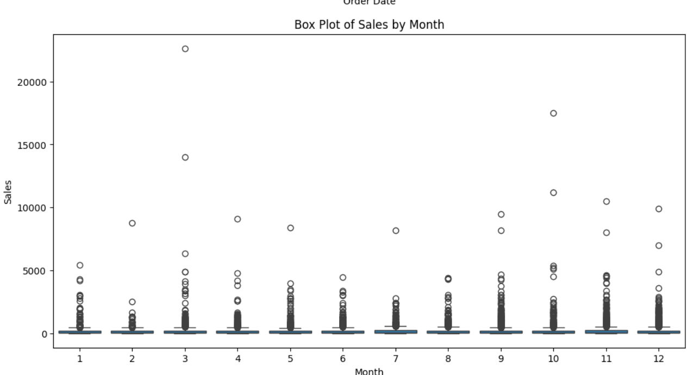
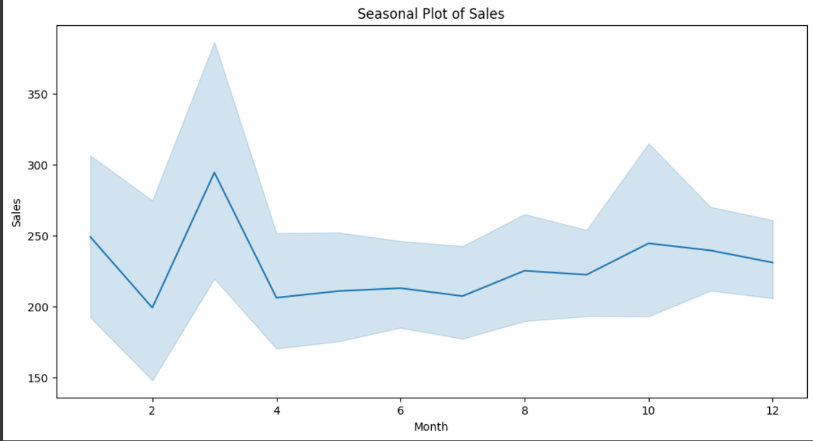
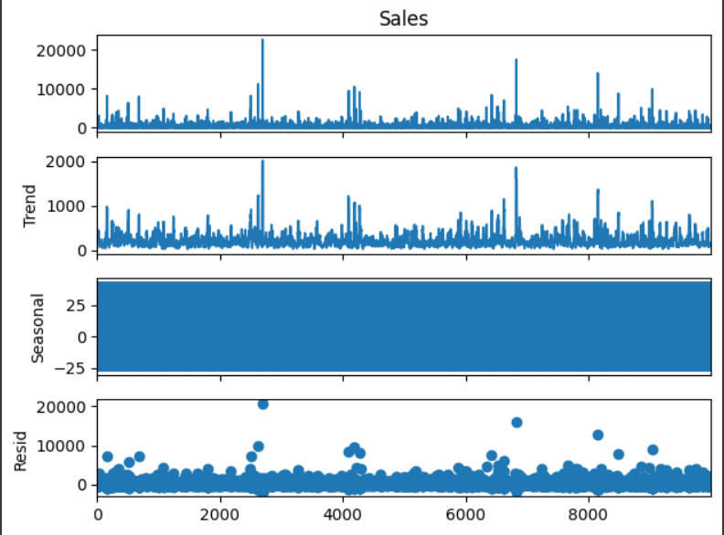
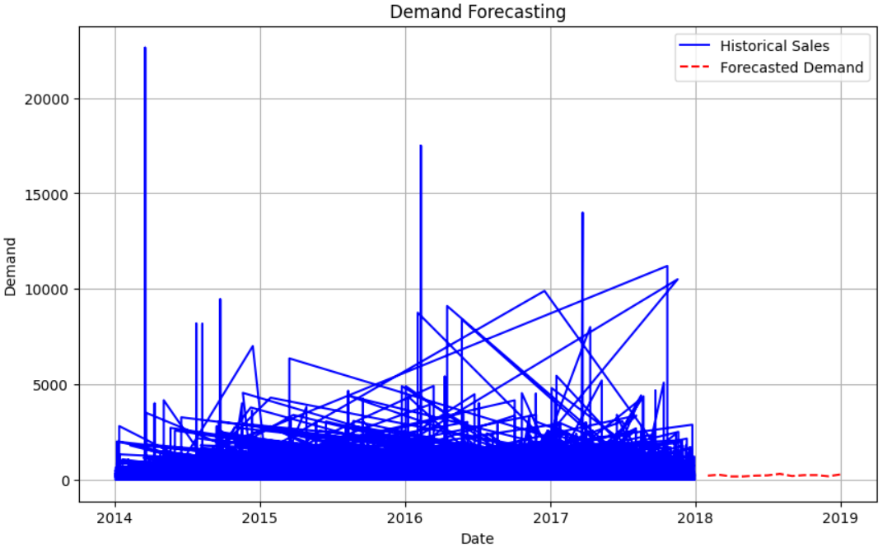

# DemandWizard

**Discover future demand trends with DemandWizard, a versatile project showcasing diverse forecasting models for insightful predictions.**

## DemandWizard: Unveiling Future Trends

Welcome to DemandWizard, your gateway to unlocking the secrets of future demand! With a collection of advanced forecasting models and insightful data analysis, DemandWizard empowers you to predict demand trends with confidence and precision.

## Overview

Demand forecasting is a crucial aspect of business planning, enabling organizations to anticipate customer demand, optimize inventory management, and make informed strategic decisions. DemandWizard offers a comprehensive solution for demand forecasting, leveraging a variety of forecasting models and sophisticated data analysis techniques.

## Key Features

- **Diverse Forecasting Models**: Explore a range of forecasting models, including Random Forest regressor, SARIMA, ARIMA, and XGBoost, to discover the best approach for your forecasting needs.
- **Insightful Data Analysis**: Gain valuable insights into historical sales data through interactive visualizations and exploratory data analysis (EDA).
- **Accurate Predictions**: Generate accurate demand forecasts for future time periods, enabling proactive decision-making and resource allocation.
- **Easy-to-Use**: With user-friendly notebooks and clear documentation, getting started with DemandWizard is effortless.

## Installation

To use DemandWizard, simply clone this repository to your local machine and follow the instructions provided in the notebooks.

```bash
git clone https://github.com/Sam-1806/DemandWizard.git
```

Usage
-Open the Jupyter notebooks included in the repository.
-Follow the step-by-step instructions to preprocess the data, train the forecasting models, and generate demand forecasts.
-Explore the visualizations and interpret the results to gain insights into future demand trends.

Data Analysis
Visualizations
Check out some of the captivating visualizations generated during the data analysis phase:








Results

-After thorough analysis and comparison of the forecasting models, it was found that Random Forest Regression outperformed other methods in terms of accuracy and robustness. The Random Forest model demonstrated superior performance in capturing complex patterns and variations in demand data, resulting in more accurate forecasts with lower errors.

Forecasted Demand
Here are the forecasted demand trends obtained using different forecasting models:




License
This project is licensed under the MIT License - see the LICENSE file for details.
